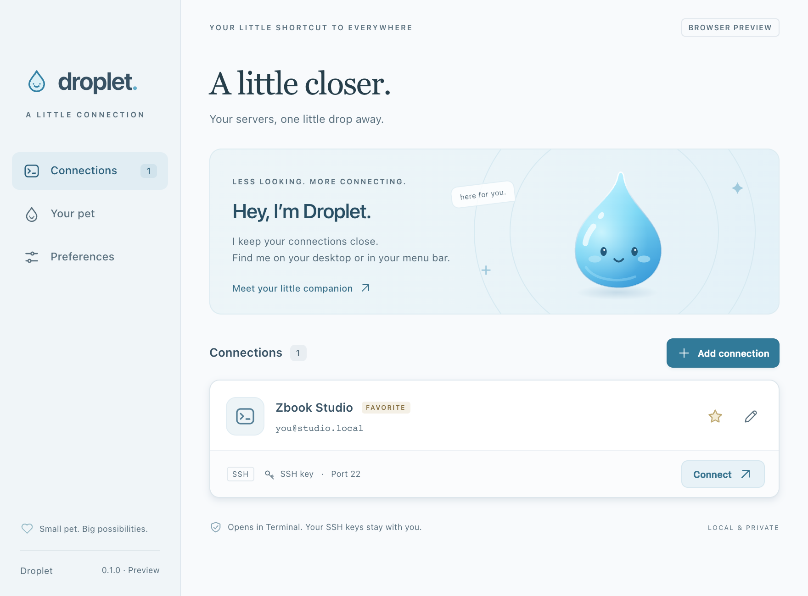
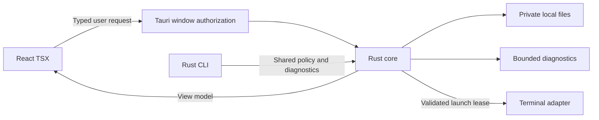

# Droplet

A desktop companion that keeps SSH connections close. Choose a theme, then a pet: Remy (Remy, Emile), Pokémon (Pikachu, Eevee, Bulbasaur, Charmander, Squirtle, Jigglypuff), Snoopy (Snoopy, Woodstock, Belle), or the original Droplet. **Tauri 2 stays the desktop shell; Rust owns the application; React TSX owns the interface.** macOS and Windows are supported native targets; Linux terminal integration remains planned.



## Use it on macOS or Windows

Open `Droplet.app`. On first launch, Droplet imports the plain SSH invocation in `~/Desktop/zbook-studio-ssh.command`, if present. It reads connection details without executing or modifying that file.

- **Menu bar/system tray:** open connections, connect to your favorite, pause new SSH launches, show/hide the pet, or quit.
- **Desktop pet:** click for connections, double-click for your favorite, drag to move. Rust keeps its position within available display bounds. The pet reflects opening, checking, paused, and attention states.
- **Your pet:** browse a theme and select its character. The pet and matching app colors update together, and the choice survives restarts. Browsing alone does not change your pet. Original character images and animation frames ship locally; [asset credits](public/pets/CREDITS.md) record their sources. Existing settings retain Droplet until you choose another pet.
- **Character animations:** the desktop pet and large preview play original animated stickers, with occasional character-specific moves. Pikachu rests with small blinks/nods; electricity, Volt Tackle travel, and Iron Tail are occasional moves. Remy's cheese/strawberry actions play original movie excerpts; Emile snacks and Snoopy dances. Small selection cards use still posters. Preview buttons replay a move without launching SSH. Normal moves are spaced 40–70 seconds apart. **Quiet movements** uses slower, smaller idle sequences and spaces big moves 90–150 seconds apart; it keeps the pet alive rather than freezing it. System accessibility reduced motion, hidden pages and pointer interactions pause motion.
- **Connection window:** add, edit, remove, favorite, search, or import a plain SSH command with `-i` and `-p`. SSH aliases are supported for launching. The saved port is always explicit, defaulting to 22.
- **Check:** inspect explicit key permissions and direct DNS/TCP/SSH-greeting reachability. Cancel a running check. These checks never authenticate; aliases and jump hosts can work even when a direct check fails.
- **Security:** pause launches from every entry point, inspect the enforced policy, and view the last 200 local activity events. The pause persists across restarts and leaves existing sessions running.
- **Touch Bar:** a horizontally scrollable list of connection shortcuts while Droplet is active on supported Macs. The favorite is highlighted, using public `NSTouchBar` APIs. It is not a persistent Control Strip replacement.
- **Preferences:** opt into starting at login or reduce animation. Closing the window keeps the pet/menu bar available. Escape hides the window; Command-N opens a connection form.

Terminal handles passwords, passphrases, host-key prompts, and session errors. On Windows, choose PowerShell or Command Prompt in Preferences; both use the installed OpenSSH client. macOS may request Automation permission the first time Droplet opens Terminal. A VPN such as Tailscale must be available if your destination needs it. “Terminal opened” does not mean “SSH authenticated.”

## What is in Rust

This repository is designed for Rust practice through useful application features:

| Crate / area | Responsibility and Rust concepts |
| --- | --- |
| `crates/droplet-core/src/model.rs` | Validation and strict import parsing; data modeling, iterators, fallible parsing. |
| `crates/droplet-core/src/service.rs` | CRUD, favorites, search, view models, launch pause, cooldowns, history; ownership, `Arc`, mutexes, state transitions, RAII operation guards. |
| `crates/droplet-core/src/security.rs` | Window authorization, key metadata checks, fixed launch policy, shell quoting. |
| `crates/droplet-core/src/storage.rs` | Bounded reads, permission checks, atomic writes, corruption preservation. |
| `crates/droplet-core/src/diagnostics.rs` | Tokio sockets, deadlines, cancellation, a bounded blocking DNS resolver, protocol inspection. |
| `crates/droplet-core/src/protocol.rs` | Serde request enums and view models; generated TypeScript contracts using `ts-rs`. |
| `crates/droplet-cli` | Read-only connection inspection and diagnostics, type export, isolated UI-test transport. |
| `src-tauri/src` | OS adapters: windows, menu bar, Terminal, login settings, and Touch Bar bridge. |
| `src/*.tsx` | Rendering, accessibility, raw form text, dialogs, and pointer gestures. |



There is no second validation/favorites/SSH implementation in TypeScript. The frontend renders backend decisions such as `canConnect`, `isFavorite`, connection labels, diagnostic results, and pet mood. UI state stays in React. OS-specific integration stays in Rust, with a small Objective-C AppKit bridge for Touch Bar.

## Develop and build

Requirements: Node.js 22.12+ or a current release, Rust 1.98+, and the native build tools for the target OS. macOS requires macOS 11+ and Xcode Command Line Tools. Windows requires the MSVC C++ build tools and WebView2 runtime.

```sh
source "$HOME/.cargo/env" # if rustup's bin directory is not on PATH
npm ci
npm run app:dev

# Standalone macOS bundle
npm run app:build
```

The bundle is at `src-tauri/target/release/bundle/macos/Droplet.app`. Install it in `~/Applications` or `/Applications` before enabling launch at login. The workspace uses the same target directory for all Rust crates.

`npm run dev` shows a **read-only browser preview** with sample data generated by Rust. It does not read your live connections, run SSH, or maintain a simulated frontend database. Use the desktop app for interactive use.

```sh
# After changing Rust protocol types
npm run types
npm run types:check

# Refresh the static sample view models
npm run preview:data

# Rust tools using your saved configuration (read-only)
cargo run -p droplet-cli -- list
cargo run -p droplet-cli -- doctor "Zbook Studio"
# Explicitly include a direct network probe
cargo run -p droplet-cli -- doctor "Zbook Studio" --network
```

`doctor` defaults to local checks. It prints a JSON report and never starts an SSH session. No daemon, plugin engine, or custom SSH implementation is needed for these features.

## Verification

```sh
cargo fmt --all --check
cargo clippy --workspace --all-targets -- -D warnings
cargo test --workspace
npm run types:check
npm run build
npm test
```

Playwright uses installed Google Chrome. Each UI test runs a fresh Rust CLI process with a temporary data directory and sample connections. The actual core handles CRUD, validation, favorites, search, launch pause, and local diagnostics. The development transport cannot launch Terminal or inspect real credentials; it is removed from production JavaScript.

Rust tests cover injection rejection, window authorization, explicit key permissions, OpenSSH expansion tokens, effective policy against a controlled SSH config, storage corruption/symlinks/size limits, launch guards and cooldowns, old-settings migration, cancellation, stale results, and stalled network responses. UI tests cover workflows, unsafe imports, Rust validation, lock state across renderer reloads, escaped rendering, pet gestures, minimum-window layout, and automated WCAG A/AA checks.

Native checks still require an unlocked Mac: inspect menu and transparent pet, drag across monitors, launch Terminal, and confirm login behavior. Touch Bar testing needs supported hardware or a simulator. Automated browser checks do not establish VoiceOver or native-platform correctness.

## Protection and limits

The new launch policy keeps host-key prompts on, disables agent/X11 forwarding, configured port forwards, `LocalCommand`, and configured remote commands. It checks explicit key-file ownership and permissions, limits repeated launches, and gives the pet fewer privileges than the main window.

Settings and local activity live in `~/Library/Application Support/com.jarrod.droplet`. Files are bounded, written atomically, and private on macOS. Invalid files are preserved and block mutations until repaired. Old connection settings remain compatible. No key contents or passwords are read or stored.

**SSH config remains trusted local code**, including `ProxyCommand` and `Match exec`. The pause is a convenience lock, not authentication. Activity history is local and not tamper-proof. See [SECURITY.md](SECURITY.md) for exact guarantees, compatibility trade-offs, failure behavior, and known limits.

Linux terminal adapters and equivalent Linux ACL checks remain future work. The transparent pet uses Tauri's macOS private API feature; the current implementation is intended for direct distribution, not Mac App Store review. This local bundle is ad-hoc signed. Public distribution needs Developer ID signing and notarization.

## Practical quality decisions

| Quality | Decision and trade-off |
| --- | --- |
| Functional suitability | All entry points use one saved favorite and launch policy. Terminal owns the session. |
| Reliability | Atomic settings replacement, bounded operations, cancellation guards, explicit errors, and stale-result rejection. |
| Performance | No periodic network polling. One diagnostic at a time; bounded DNS/TCP/banner work and history. React adds frontend weight in exchange for clear TSX components. |
| Maintainability | Portable core, generated contracts, thin OS/transport layers, and UI tests that reuse real Rust behavior. |
| Compatibility | Uses installed OpenSSH, agent, and SSH aliases. Enforced forwarding/remote-command restrictions can change behavior for advanced SSH configs. |
| Security | Least-privilege pet, Rust authorization and validation, explicit SSH policy, private storage, no secret-content handling. |
| Usability | Quick favorite access, visible paused state, cancellation, form errors, destructive-action confirmation, and reduced motion. |
| Portability | Cross-platform core/CLI foundations; native launch, permissions, window-manager behavior, and packaging still need platform-specific work. |

For quality in use, favorites reduce the steps to connect; keyboard access and reduced motion support different interaction needs. Bounded diagnostics give useful feedback on slow/offline networks without claiming successful authentication. Recoverable pet placement supports monitor changes. Local storage and explicit launch controls reduce accidental actions while keeping the app small enough to understand and extend.
